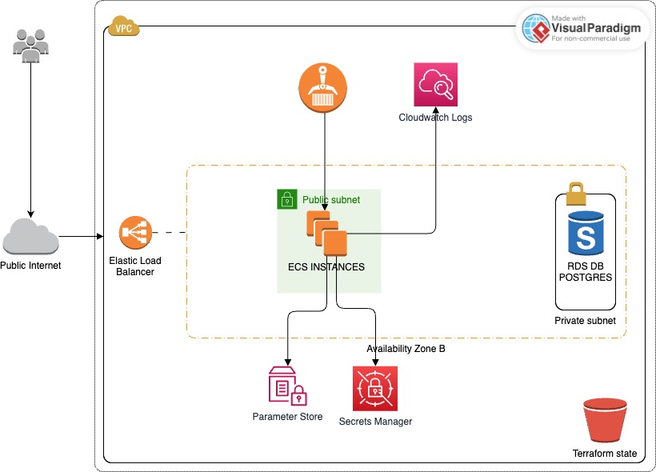

# Franchise Service — Nequi

API reactiva para la gestión de franquicias, sucursales y productos, construida con **Spring WebFlux**, **R2DBC**, **PostgreSQL** y desplegada en **AWS ECS** mediante **Terraform** y **GitHub Actions**.

---

## Tabla de Contenidos

1. [Arquitectura](#arquitectura)
2. [Módulos del Proyecto](#módulos-del-proyecto)
3. [Modelo de Datos](#modelo-de-datos)
4. [Ejecución Local con Docker](#ejecución-local-con-docker)
5. [Infraestructura en AWS](#infraestructura-en-aws)
6. [CI/CD — GitHub Actions](#cicd--github-actions)
7. [Resiliencia](#resiliencia)
8. [Tecnologías](#tecnologías)

---

## Arquitectura

El proyecto implementa **Clean Architecture**, separando las responsabilidades en capas independientes:


### Diagrama del Proyecto



---

## Módulos del Proyecto

```
nequi_julio/
├── domain/
│   ├── model/          → Entidades, comandos, gateways (interfaces) y excepciones
│   └── usecase/        → Lógica de negocio: FranchiseUseCase, BranchUseCase, ProductUseCase
├── infrastructure/
│   ├── driven-adapters/
│   │   └── r2dbc-postgresql/   → Adaptadores de BD: entidades, mappers, repositorios reactivos
│   └── entry-points/
│       └── reactive-web/       → Handlers, Router, DTOs, validadores, configuración CORS
├── applications/
│   └── app-service/    → Ensamblaje de la app, configuración, migraciones Flyway
├── deployment/
│   └── Dockerfile
└── terraform/          → Infraestructura como código (AWS)
```

### Domain — Model

Contiene los modelos de dominio puros y las interfaces (gateways) que el dominio expone:

| Entidad     | Descripción                                      |
|-------------|--------------------------------------------------|
| `Franchise` | Franquicia raíz del negocio                      |
| `Branch`    | Sucursal perteneciente a una franquicia           |
| `Product`   | Producto con stock asociado a una sucursal        |

Excepciones de dominio: `BusinessException`, `TechnicalException`, `ProcessorException`.

### Domain — Usecases

| Use Case           | Operaciones                                                  |
|--------------------|--------------------------------------------------------------|
| `FranchiseUseCase` | `createFranchise`, `updateName`                              |
| `BranchUseCase`    | `createBranch`, `updateName`                                 |
| `ProductUseCase`   | `createProduct`, `deleteProduct`, `updateStock`, `updateName`, `getTopProductsPerBranch` |

### Infrastructure — Driven Adapters (R2DBC)

Implementa los gateways del dominio usando Spring Data R2DBC con PostgreSQL. Incluye:
- Repositorios reactivos: `FranchiseReactiveRepository`, `BranchReactiveRepository`, `ProductReactiveRepository`
- Mappers entre entidades de BD y modelos de dominio
- Circuit Breaker configurado sobre las operaciones de base de datos

### Infrastructure — Entry Points (Reactive Web)

Router funcional con handlers para cada recurso. Incluye validación de requests con Bean Validation y cabeceras de seguridad.

---

## Modelo de Datos

```sql
franchise
├── id          BIGSERIAL PK
└── name        VARCHAR(100)

branch
├── id          BIGSERIAL PK
├── name        VARCHAR(100)
└── franchise_id → franchise(id) ON DELETE CASCADE

product
├── id          BIGSERIAL PK
├── name        VARCHAR(100)
├── stock       INT
└── branch_id   → branch(id) ON DELETE CASCADE
```

Índices: `idx_branch_franchise_id`, `idx_product_branch_id`, `idx_franchise_name`.

Las migraciones se ejecutan automáticamente con **Flyway** al iniciar en perfil `prod`.

---

## Ejecución Local con Docker

### Requisitos

- Docker y Docker Compose instalados
- Java 17
- Gradle

### 1. Levantar la base de datos

```bash
docker-compose up -d
```

| Parámetro | Valor           |
|-----------|-----------------|
| Host      | `localhost:5432` |
| DB        | `nequi_db`      |
| User      | `nequi_user`    |
| Password  | `nequi_password`|

### 2. Ejecutar la aplicación

```bash
./gradlew bootRun --args='--spring.profiles.active=local'
```

### 3. Detener la base de datos

```bash
docker-compose down
```

---

## Infraestructura en AWS

La infraestructura se gestiona con **Terraform** y el estado se almacena en S3 (`nequi-terraform-state-jonathan-londono`).

### Módulos Terraform

| Módulo        | Recurso AWS                  | Descripción                                      |
|---------------|------------------------------|--------------------------------------------------|
| `networking`  | VPC, Subnets, Security Groups| Red privada con subnets públicas y privadas      |
| `ecr`         | ECR Repository               | Registro de imágenes Docker                      |
| `rds`         | RDS PostgreSQL (`db.t3.micro`)| Base de datos en subnets privadas               |
| `secrets`     | AWS Secrets Manager          | Almacena credenciales y configuración de resiliencia |
| `alb`         | Application Load Balancer    | Balanceador de carga público en puerto `8080`    |
| `ecs`         | ECS Fargate Cluster + Service| Contenedor con auto-scaling (min: 1, max: 3)     |

### Configuración del Contenedor ECS

| Parámetro  | Valor   |
|------------|---------|
| CPU        | 256 units |
| Memoria    | 512 MB  |
| Puerto     | 8080    |
| Java opts  | `-XX:+UseContainerSupport -XX:MaxRAMPercentage=70` |

### Secretos requeridos en GitHub

Configura estos secretos en **Settings → Secrets and variables → Actions**:

| Secret                  | Descripción                          |
|-------------------------|--------------------------------------|
| `AWS_ACCESS_KEY_ID`     | Access key del usuario IAM           |
| `AWS_SECRET_ACCESS_KEY` | Secret key del usuario IAM           |
| `AWS_REGION`            | Región de AWS (ej: `us-east-1`)      |
| `DB_USER`               | Usuario de la base de datos en RDS   |
| `DB_PASSWORD`           | Contraseña de la base de datos en RDS|

---

## CI/CD — GitHub Actions

El pipeline se activa automáticamente en cada push a la rama `main` y ejecuta dos jobs en secuencia:

```
push → main
    │
    ├── [1] Terraform
    │       ├── terraform init
    │       ├── terraform plan
    │       └── terraform apply (infraestructura en AWS)
    │
    └── [2] Build & Deploy (requiere que Terraform termine)
            ├── ./gradlew build  (genera el JAR)
            ├── docker build + push → ECR
            └── aws ecs update-service (force new deployment)
```

---

## Resiliencia

El adaptador de base de datos está protegido con **Resilience4j** usando el circuit breaker `databaseNequi`:

| Patrón          | Configuración por defecto                        |
|-----------------|--------------------------------------------------|
| Circuit Breaker | Ventana de 5 llamadas, umbral de fallo al 50%    |
| Time Limiter    | Timeout de 3 segundos por operación              |
| Retry           | 3 reintentos con espera de 500ms entre cada uno  |

---

## Tecnologías

| Tecnología          | Versión / Detalle                  |
|---------------------|------------------------------------|
| Java                | 17                                 |
| Spring Boot         | WebFlux (reactivo)                 |
| R2DBC               | PostgreSQL driver reactivo         |
| Flyway              | Migraciones de base de datos       |
| Resilience4j        | Circuit Breaker, Retry, TimeLimiter|
| Lombok              | Reducción de boilerplate           |
| Terraform           | AWS Provider ~> 5.0                |
| Docker              | eclipse-temurin:17-jdk-alpine      |
| GitHub Actions      | CI/CD pipeline                     |
| AWS ECS Fargate     | Orquestación de contenedores       |
| AWS RDS PostgreSQL  | db.t3.micro                        |
| AWS ECR             | Registro de imágenes               |
| AWS ALB             | Balanceo de carga                  |
| AWS Secrets Manager | Gestión de secretos                |
